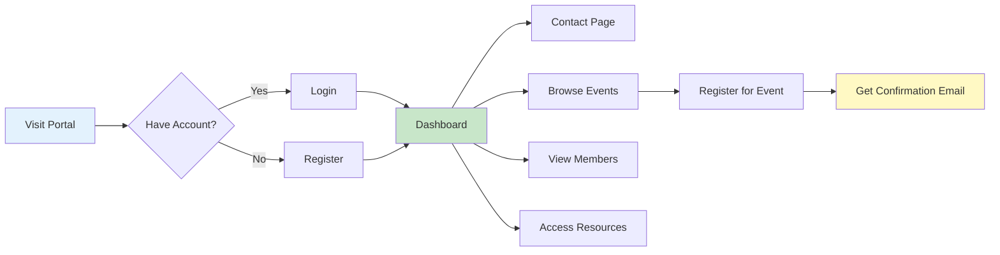
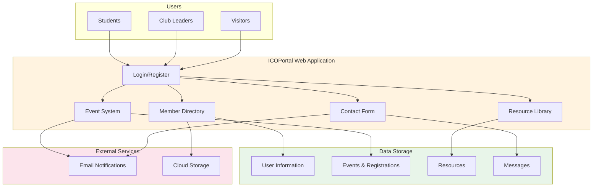
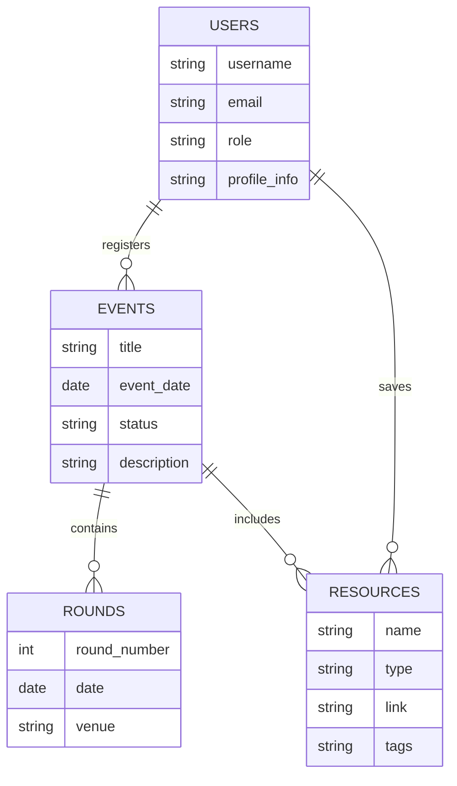
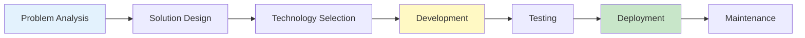

# 🌐 ICOPortal - Institutional Club Operations Portal

**A centralized digital platform transforming club management in educational institutions**

---

## 📖 Aim of The Project

ICOPortal (Internships and Opportunities Club Portal) is a web-based platform designed to solve the everyday challenges of managing a student club. Built as a complete solution to replace scattered WhatsApp groups, manual registrations, and disorganized resource sharing with a single, unified digital platform.

### 🎯 The Problem

Educational institutions struggle with club management due to:

- **Scattered Communication** - Important announcements lost in multiple WhatsApp groups
- **Manual Processes** - Paper-based or spreadsheet event registrations  
- **Poor Organization** - No central place for member information
- **Resource Chaos** - Study materials and resources shared randomly across platforms
- **Limited Transparency** - Difficulty tracking who's doing what
- **Inefficient Coordination** - Hours wasted on basic administrative tasks

### ✨ The Solution

A comprehensive web platform that brings everything under one roof:

✅ Centralized event announcements and registration  
✅ Digital member directory with profiles  
✅ Organized resource library for sharing materials  
✅ Professional club presence online  

---

### 1️⃣ Member Portal
**What it does**: Professional directory showcasing all club members

- 👤 Detailed member profiles with photos and bio
- 🏆 Role-based hierarchy (Leadership → Executives → Members)
- 🔗 Social media integration (LinkedIn, GitHub, Instagram)
- 📄 Resume and portfolio links
- 🎓 Academic information tracking

**Impact**: Improved professional networking within the club

---

### 2️⃣ Resource Library
**What it does**: Centralized repository for study materials and learning resources

- 📚 Categorized resources (PDFs, Videos, Links, Code Repositories)
- 🔍 Smart search functionality
- 💾 Save favorite resources for later
- 🏷️ Tag-based organization
- ⭐ Easy resource contribution

**Impact**: 100+ resources organized and easily accessible

---

### 3️⃣ User Accounts & Security
**What it does**: Secure login system with personalized experiences

- 🔐 Email-based authentication
- 🛡️ Password protection and encryption
- 👤 Personalized user dashboards
- ✏️ Profile customization
- 🔒 Protected event registration

**Impact**: Secure platform with 100% data privacy

---

### 4️⃣ Communication Hub
**What it does**: Professional contact system for inquiries and collaboration

- 📧 Structured contact form
- 🎯 Categorized subjects (Inquiry, Collaboration, Sponsorship, etc.)
- ✉️ Automated email confirmations
- 🔔 Admin notifications
- 📝 Message tracking

**Impact**: Streamlined external communication and opportunities

---

## 🏗️ How It Works

### Simple User Flow

```mermaid
flowchart LR
    A[Visit Portal] --> B{Have Account?}
    B -->|Yes| C[Login]
    B -->|No| D[Register]
    C --> E[Dashboard]
    D --> E
    E --> K[Contact Page]
    E --> F[Browse Events]
    E --> G[View Members]
    E --> H[Access Resources]
    F --> I[Register for Event]
    I --> J[Get Confirmation Email]
    
    style A fill:#e3f2fd
    style E fill:#c8e6c9
    style J fill:#fff9c4
```

---

## 🛠️ Built With

### Technology Stack

**Backend**
- Django 6.0 - Python web framework
- Python 3.12 - Programming language
- SQLite/PostgreSQL - Database systems

**Frontend**
- HTML5 & CSS3 - Structure and styling
- JavaScript - Interactive features
- Font Awesome - Icons
- Google Fonts - Typography

**Tools Used**
- SupaBase
- Cloudinary
- Render
- Google Apps

**Features**
- Email integration via Gmail
- Image upload and processing
- Form validation and security
- User authentication system
- Cloud deployment ready

---

## 📊 System Overview

### Platform Architecture

```mermaid
flowchart TB
    subgraph Users
        A[Students]
        B[Club Leaders]
        C[Visitors]
    end
    
    subgraph WebApp[ICOPortal Web Application]
        D[Login/Register]
        E[Event System]
        F[Member Directory]
        G[Resource Library]
        H[Contact Form]
    end
    
    subgraph Data[Data Storage]
        I[User Information]
        J[Events & Registrations]
        K[Resources]
        L[Messages]
    end
    
    subgraph Services[External Services]
        M[Email Notifications]
        N[Cloud Storage]
    end
    
    A --> D
    B --> D
    C --> D
    
    D --> E
    D --> F
    D --> G
    D --> H
    
    E --> J
    F --> I
    G --> K
    H --> L
    
    E --> M
    H --> M
    F --> N
    
    style WebApp fill:#fff3e0
    style Data fill:#e8f5e9
    style Services fill:#fce4ec
```

### Data Organization

```mermaid
erDiagram
    USERS ||--o{ EVENTS : registers
    USERS ||--o{ RESOURCES : saves
    EVENTS ||--o{ ROUNDS : contains
    EVENTS ||--o{ RESOURCES : includes
    
    USERS {
        string username
        string email
        string role
        string profile_info
    }
    
    EVENTS {
        string title
        date event_date
        string status
        string description
    }
    
    RESOURCES {
        string name
        string type
        string link
        string tags
    }
    
    ROUNDS {
        int round_number
        date date
        string venue
    }
```

---

## 📱 Features Walkthrough

### For Students

1. **Create Account** - Register with student ID and email
2. **Browse Events** - See all upcoming club activities
3. **Quick Registration** - One-click event sign-up
4. **Build Profile** - Add bio, resume, social links
5. **Save Resources** - Bookmark useful study materials
6. **Get Notified** - Receive email confirmations

### For Visitors

1. **Explore Club** - Learn about the organization
2. **View Events** - See upcoming activities
3. **Contact Team** - Send collaboration requests
4. **Access Resources** - Browse public materials

---

### Benefits

✅ **Time Savings** - Reduced administrative work by 10+ hours/week  
✅ **Better Organization** - All club operations in one platform  
✅ **Improved Engagement** - Higher participation in events  
✅ **Professional Image** - Modern digital presence  
✅ **Data Insights** - Track trends and participation  
✅ **Scalability** - Ready for club growth  

---

## 🔐 Security & Privacy

### Protecting User Data

- 🔒 **Encrypted Passwords** - Industry-standard password hashing
- 🛡️ **Secure Sessions** - Protected login sessions
- ✅ **Form Validation** - Prevents invalid or malicious data
- 🔐 **Email Verification** - Confirms user identity
- 🚫 **Access Control** - Role-based permissions
- 🔑 **Environment Security** - Sensitive data never exposed

### Privacy Measures

- Personal information visible only to members
- Email addresses protected from spam
- Optional profile fields for privacy
- Secure file uploads
- HTTPS encryption in production

---

## 🚀 Deployment

### Production-Ready

The platform is configured for deployment on:

**Cloud Platforms**
- ✅ Render.com (Primary)
- ✅ Heroku
- ✅ PythonAnywhere
- ✅ AWS/Google Cloud

**Server Deployment**
- ✅ Ubuntu/Linux servers
- ✅ Docker containers
- ✅ VPS hosting

**Key Features**
- Automatic HTTPS/SSL
- Scalable infrastructure
- Database backups
- Email notifications
- Static file optimization

---

## 🎓 Learning Outcomes

### Skills Demonstrated

**Technical Skills**
- Full-stack web development
- Database design and management
- User authentication systems
- Email integration
- Form handling and validation
- Cloud deployment
- Security best practices

**Project Management**
- Problem identification and analysis
- Solution architecture design
- User experience design
- Testing and debugging
- Documentation

**Tools & Technologies**
- Python programming
- Django framework
- SQL databases
- HTML/CSS/JavaScript
- Git version control
- Command line interface
- Cloud platforms

---

## 🔄 Development Process

### Project Lifecycle

```mermaid
flowchart LR
    A[Problem Analysis] --> B[Solution Design]
    B --> C[Technology Selection]
    C --> D[Development]
    D --> E[Testing]
    E --> F[Deployment]
    F --> G[Maintenance]
    
    style A fill:#e3f2fd
    style D fill:#fff9c4
    style F fill:#c8e6c9
```

### Methodology

1. **Research** - Identified club management challenges
2. **Planning** - Designed solution architecture
3. **Development** - Built features incrementally
4. **Testing** - Ensured quality and security
5. **Deployment** - Made accessible online
6. **Iteration** - Continuous improvements

---

## 📄 License

This project is a personal/academic project developed for [RGUKT].

**Usage Rights**: This is a proprietary project and not open for public contributions.

---

## 🌟 Thank You for Reviewing!

### Questions or Feedback?

📧 **Email**: [royalalearner@gmail.com]  
💼 **LinkedIn**: [https://www.linkedin.com/in/royalsasanala/]  
🐙 **GitHub**: [https://github.com/royallearner/]

---

**Built with dedication to solve real problems**

⭐ **ICOPortal** - Transforming Club Management

